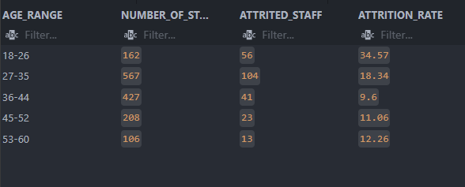
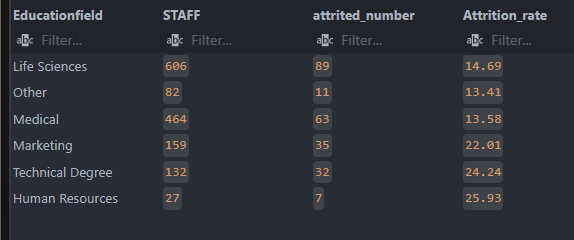
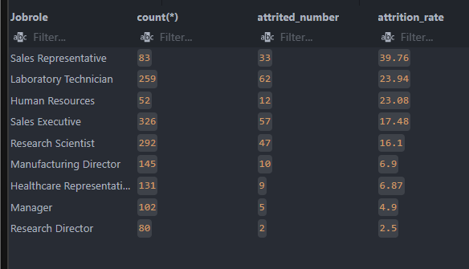
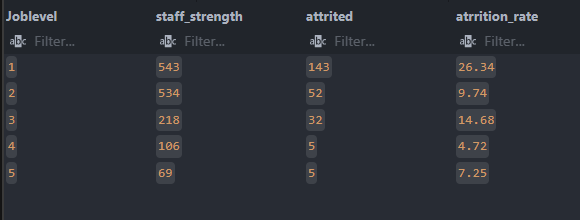
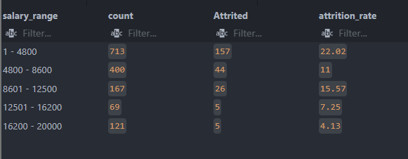
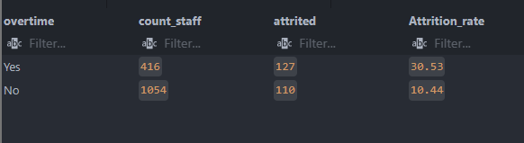
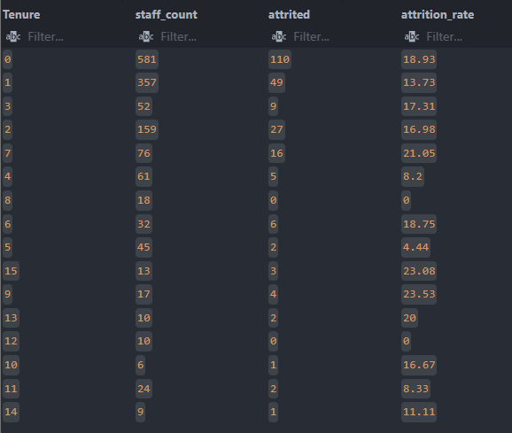
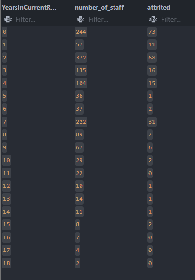

## HR ATTRITION REPORT (SQL PROJECT)

## PROJECT OVERVIEW

This project analyzes employee attrition rates and patters to identify the key drivers of workforce turnover.
I used SQL for data exploration and business-focused analysis to check factors such as department, job role, gender, salary age and satisfaction level.
The goal of project is to generate actionable insights that can help companies improve staff retention and reduce turnover.

## Business Problem

Employee attrition affects organisations negatively in the following ways

- Increased attrition leads to loss of experienced hands, leaving the organisation drained
- high attrition leads to the need to recruitment of new staff which will lead to high recruitment and training cost.
- reduces the companies productivity.
- The alove listed could also lead to loss of customer and conesequently revenue.

## Dataset information

    - Total Number of Employees: 1,470
    - Attrition Count: 237
    - Attrition Rate: 16.12%
    - Data source: BMW Dataset (Kaggle)

## Key Collumns:

            Age
            Department
            jobsatisfaction
            gender
            maritalstatus
            jobrole
            joblevel
            jobinvolvement
            monthlyincome
            overtime
            distance from home
            businesstravel
            tenure
            yearsSinceLastPromotion
            YearsAtcompany
            overtime

## Tools and Skills used

    - SQL (Data Analysis)
    - Excel (Data Inspection and Review)
    - Aggregation (Group By, Count, SUM)
    - CASE statements
    - Subqueries
    - CTE
    -Business Insights

## DATA ANALYSIS

### 1. Overall Attrition rate

-Attrition rate: 16.12%

**Insight:**
The organisation experiences a moderates level of employee turnover requiring the organisation to look inward and create employee retention strategies.

### 2.Department Analysis

Research and Development recorded the highest number of staff in the organisation with 961 staff out of the total 1,470 staff, however, the sales team with 446 ( the Second most populated department) led the attrition with 20.63% and human resource with 63 staff had an attrition rate of 19%. Research and development had the lowest attrition rate at 13.84%.
A deep dive into the job satisfaction levels of those who left shows a very high percentage of HR staff scoring 1 on the job satisfaction score while R&D and sales showed no relationship between job satisfactoin and attrition.

**Insights**
The sales department had the highest attrition rate, however scored higher on the job satisfaction score suggesting attrition may not be linked to satisfaction but other factors like better pay from competitors.

### 3. Gender analysis

40% of the total staff are female while 60% are men. Atttrition rate for men stood at 17% while women was 14.8%.

**Insight**
men are more drivers of the attriton rate than the women.

### 4. Age Analysis

The age was divided into 5 group: 18-26 | 27-35 | 36-44 | 45-52 and 53-60.
While Group 18-26 had only 162 staff in total, they Had an very high attrition rate almost twice as high as the next group (27-35) which came second with an attrition rate of 18.24% as compared to 34.57% by the 18-26 age group. A dive into the job satisfaction score and the age groups shows that job satisfaction was not a major driver for those who left as more than 50% scored within 3 and 4 in the survey.

**Insight**
The Entry level groups leave the company early, but not because they dont enjoy the job. This may be an indication of uncertain career path in the company, low renumeration for The entry levels and external market pulls.

### 5. Overall Job satisfaction

overall Job satisfaction report shows a fair job satisfaction score.

**insights**
above 50% of the staff who left scored high on the jobsatisfaction scale suggesting they are not leaving because of a toxic work environment, rather for possible promotion and pay raise. this may be an indication to look at the career ladder as we saw from the age analysis as those at the entry stages leaave the most.

### 6. Matrital Status and Attrition

25.53% of single people quit as against 12% for married and 10% for divorced.

**insight**
Single people are more than 2x likely to leave as compare the their other counterparts as they have no achor to keep them in one place. married staff possibly do not leave due to family and the need for balance.

### 7. EDUCATIONAL FIELD

Staff who majored in Human resources, Technical degree and marketing got the highest attrition rates 25, 24.24 and 22.01 respectively. This suggests a high pouching activity by competitors especially when compared with the age group analysis result and satisfaction scores.

**Insight**
Staff may be leaving due to better offers from other companies.

### 8. JOB ROLE ANALYSIS

Job role analysis reveals more about the educational field information. the sales reps leading the attrition movement with 39.76% followed by lap techicians, human resource and sales executives.
**Insight**
Just as pointed out, efforts must be made to make the job more attractive to these catgory of staff members to ensure they are not lost to competition.

### 9. JOb Level analysis

Job level nanalysis shows a high attrition rate of staff of level as compared to the other levels. Mid-level staff of level 3 also show significant high atttrition rate which could also be attributed to compititors attracting talents from the company.

**insight**
The staff at the lowest level left the most, signifying poor career growth prospect. Staff of level 3 high attrition count could also be as a result of slow career progression.

### 10. Job Involvement Analysis

Job involvement analysis shows that staff who were less involved had a higher chance of leaving the organisation. 33% of staff who had a score of 1 in job involvement left.

**insight**
HR must identify passionate individuals who are not just coming in to just have a job. The more involved staff are with their jobs, the less the attrition. HR must also identify if there are factors that make the job unappealing to these lower level staff to ensure motivation is not lost at the point of onboarding.

### 11. Salary Range and attrition

Salary range analysis corellates with the job level analysis as staff who earn the lowest left the most followed by the mid-level staff.

**Insight**
Effort must be made to overhaul the beneits of these lower level staff, efforts should also be made to make the career ladder better to further reduce turn over.

### 12. Overtime and attrition

Staff who did overtime where three time more likely to leave than staff who did no overtime.
staff who did overtime also had lower job satisfaction scores.;

### 13. Distance from home

Distance from home had no significant impact on the attrition rates.

### 14. Business Travel and Attrition

Staff who travelled often had an almost twice higher chance of leaving.

**insight**
This many be as a result of the stress and wear of traveling frequently. as we can see from the table, the more the staff traveled, the more the chance of leaving as even staf who rarely travelled had an attrition rate of 14.96% and none travel had just 8%. Efforts should be made to cussion the effect of the business travel to mitigate the high attrition rate.

### 15. Years Since last promotion vs Attrition

staff who have had no promotion or just got promoted had the highest attrition rate, correlating with the age and salary analysis. some mid-level staff also had a higher attrition rate.

### 16. Years In company

Years in company analysis shows that the newest members of the company leave more.
Correlating with earlier insights about staff attrition coming from the youngest workforce.

### 17. Years In current Role

We checked to see if staying in the same role increased attrition, however,, those who have stayed in the role longer had a better retention rate than those who did not.

**Insight**
This correlates with the earlier discovery that entry level staff had a higher attrition rate.

### 18. Salary Groups and work life balance

Staff who had a high and medium salary scored better in job satisfaction. while those who had lower salaries scored low in job work life balance plus a very high attrition rate signifying that better salary leads to better work life balance.

---

## Major Insights

    - Attrition rate is 16.12%, not too high, but may soon become concerning if issues are not resolved.
    - Younger Employees are more likely to leave.
    - Entry level employees are more likely to leave along side mid-level employees.
    - Overtime is a major driver of atttrition.
    - Staff who engaged in travel had a significantly higher attrition rate than staff who did not travel at all.
    - Sales Department had the highest attrition rate with sales reps leading the attrition scoreboard
    - Men are more drivers of attrition than women
    - overall job satisfaction report shows a fair job satisfaction score accross board
    - Single people are more likely to leave.
    - staff with low job involcment were more likely to leave
    - Better salay resulted in better work life balance

## project Files

    - SQL queries: 'HR ATTRIUTION.sql'
    - dataset: 'HR_ATTRIUTION_PROJECT.csv'

## Author

**Nnaemeka Ijeoma**
